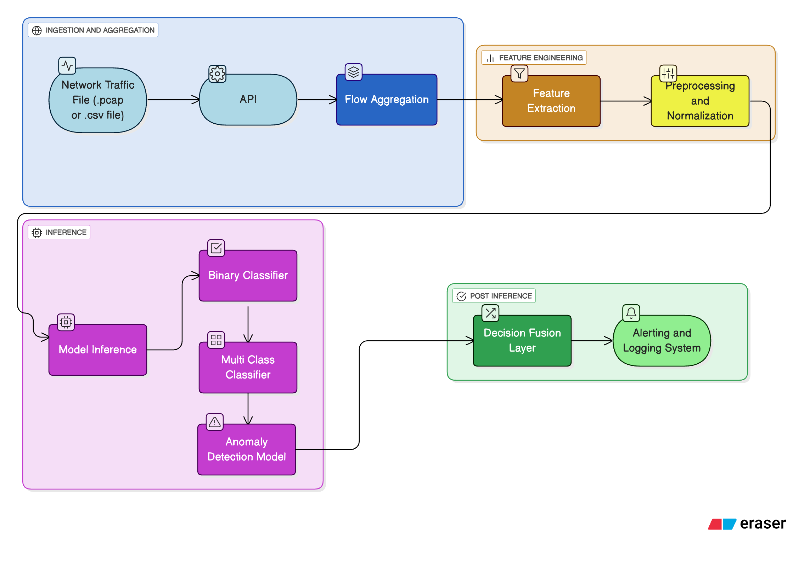

# 🛡️ AI-Powered Intrusion Detection System
A comprehensive Network Intrusion Detection System that leverages machine learning and deep 
learning to detect and classify network attacks in real-time. Built on the **CICIDS 2017 
dataset**, the system implements three detection approaches: binary classification, 
multiclass attack identification, and anomaly detection for zero-day threats.
> Real-time network attack detection using machine learning. Detect and classify 14 attack types with 99.9% binary accuracy and 97.5% multiclass accuracy.

[](https://www.python.org/)
[](https://fastapi.tiangolo.com/)
[](https://reactjs.org/)

---

## ✨ Features

- 🔍 **Binary Classification** - BENIGN vs ATTACK (~99.9% accuracy)
- 🎯 **Multiclass Classification** - 14 specific attack types (~97.5% accuracy)
- 🚨 **Anomaly Detection** - Zero-day attack detection via autoencoder
- 📡 **Real-Time API** - FastAPI server for PCAP/CSV processing
- 🌐 **Modern Frontend** - React/TypeScript web interface
- ⚡ **Production-Ready** - Optimized inference pipeline

---

## 🚀 Quick Start

### Prerequisites

- Python 3.8+ (3.12.3 recommended)
- Node.js 18+ (for frontend, optional)
- CICIDS 2017 dataset (place in `TrafficLabelling/` folder)

### Installation

```bash
# 1. Clone repository
git clone <repository-url>
cd AI_IDS

# 2. Create virtual environment
python3 -m venv venv
source venv/bin/activate  # macOS/Linux
# OR
venv\Scripts\activate     # Windows

# 3. Install dependencies
pip install -r requirements.txt

# 4. (Optional) Install frontend dependencies
cd frontend && npm install && cd ..
```

### Dataset Setup

1. Download `GeneratedLabelledFlows.zip` from [CICIDS 2017](https://www.unb.ca/cic/datasets/ids-2017.html)
2. Extract and place the `TrafficLabelling/` folder in project root

---

## 📋 Usage

### Step 1: Preprocess Data

```bash
python final_data_preprocess.py
```

Creates preprocessed datasets and artifacts in `final_preprocessed_data/`

### Step 2: Train Models

```bash
# Train all three models
python final_models/final_xgboost_binary.py
python final_models/final_xgboost_multi.py
python final_models/final_autoencoder_xgboost_anomaly.py
```

Models saved to `final_preprocessed_data/models/`

### Step 3: Start API Server

```bash
python api/api_server.py
```

Server runs on `http://localhost:8000`  
API docs: `http://localhost:8000/docs`

### Step 4: (Optional) Start Frontend

```bash
cd frontend
npm run dev
```

Frontend runs on `http://localhost:8080`

---

## 🔌 API Usage

### Upload PCAP File

```bash
curl -X POST "http://localhost:8000/predict" \
     -H "Content-Type: multipart/form-data" \
     -F "file=@network_traffic.pcap"
```

### Upload CSV Flows

```bash
curl -X POST "http://localhost:8000/predict" \
     -H "Content-Type: multipart/form-data" \
     -F "file=@flows.csv"
```

### Response Example

```json
{
  "status": "success",
  "total_flows": 1000,
  "summary": {
    "BENIGN": 800,
    "ATTACK": 150,
    "ANOMALY": 50
  },
  "attack_types": {
    "DDoS": 50,
    "PortScan": 100
  },
  "download_csv": "live/predictions_1234567890.csv"
}
```

---

## 🎯 Attack Types Detected

Bot • DDoS • DoS GoldenEye • DoS Hulk • DoS Slowhttptest • DoS slowloris • FTP-Patator • Heartbleed • Infiltration • PortScan • SSH-Patator • Web Attack (Brute Force, SQL Injection, XSS)

---

## 📊 Performance

| Model | Accuracy | Purpose |
|-------|----------|---------|
| Binary | ~99.9% | BENIGN vs ATTACK |
| Multiclass | ~97.5% | 14 attack types |
| Anomaly | Configurable | Zero-day detection |

---

## 🏗️ Architecture



```
PCAP/CSV → Flow Extraction → Preprocessing → 
  ├─ Binary XGBoost (Gatekeeper)
  ├─ Multiclass XGBoost (Attack ID)
  └─ Autoencoder (Anomaly Detection)
→ Predictions CSV
```

See [CODEBASE_SUMMARY.md](CODEBASE_SUMMARY.md) for detailed architecture.

---

## 📦 Key Dependencies

**Backend:**
- `xgboost==2.0.3` - Gradient boosting
- `tensorflow>=2.13.0` - Autoencoder
- `fastapi>=0.104.0` - API server
- `scapy` - Packet processing

**Frontend:**
- React 18.3.1
- TypeScript 5.8.3
- Vite 5.4.19

See `requirements.txt` and `frontend/package.json` for complete lists.

---

## 🐛 Troubleshooting

**"Cannot connect to API server"**
- Ensure backend is running: `python api/api_server.py`
- Check port 8000 is available

**"CICFlowMeter not found"**
- Install: `pip install git+https://github.com/hieulw/cicflowmeter.git@master`
- Ensure Scapy is installed: `pip install scapy`

**Frontend build errors**
```bash
cd frontend
rm -rf node_modules package-lock.json
npm install
```

---

## 📚 Documentation

- **Detailed Documentation**: See [CODEBASE_SUMMARY.md](CODEBASE_SUMMARY.md)
- **Project Report**: See [project_report]([https://udita-0707.github.io/AI_IDS/project_report.html])
- **API Docs**: `http://localhost:8000/docs` (when server is running)

---

## 🎯 What's Next?

- ✅ Binary, Multiclass, and Anomaly Detection
- ✅ REST API with FastAPI
- ✅ React Frontend
- ✅ Real-time PCAP/CSV Processing
- 🔄 Online Learning (planned)
- 🔄 Real-time Streaming (planned)

---

## 🙏 Acknowledgments

This project builds upon the work of many open-source contributors and research institutions:

### Datasets & Research
- **[CICIDS 2017 Dataset](https://www.unb.ca/cic/datasets/ids-2017.html)** - Canadian Institute for Cybersecurity for providing comprehensive network traffic datasets
- Research community for advancing network security and intrusion detection methodologies

### Libraries & Frameworks
- **[XGBoost](https://xgboost.ai/)** - Gradient boosting framework for high-performance classification
- **[TensorFlow/Keras](https://www.tensorflow.org/)** - Deep learning framework for autoencoder implementation
- **[FastAPI](https://fastapi.tiangolo.com/)** - Modern, fast web framework for building APIs
- **[Scapy](https://scapy.net/)** - Powerful packet manipulation library
- **[CICFlowMeter](https://github.com/hieulw/cicflowmeter)** - Python-based network flow feature extraction
- **[React](https://reactjs.org/)** - UI library for building interactive frontends
- **[shadcn-ui](https://ui.shadcn.com/)** - Beautiful and accessible component library
- **[Scikit-learn](https://scikit-learn.org/)** - Machine learning utilities and preprocessing tools

### Tools & Infrastructure
- **[Vite](https://vitejs.dev/)** - Next-generation frontend build tool
- **[TypeScript](https://www.typescriptlang.org/)** - Type-safe JavaScript
- **[Tailwind CSS](https://tailwindcss.com/)** - Utility-first CSS framework

---

**Built with ❤️ using Python, XGBoost, TensorFlow, FastAPI, and React**
